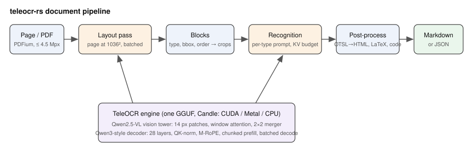

# teleocr-rs — portfolio

**Scanned pages and PDFs to Markdown with the best open OCR model, from one binary and one 1.5 GB file: a page in ~3 s on a GPU, identical to the reference.**

- **Goal**: make TeleOCR, the document-parsing model that leads
  OmniDocBench v1.6, a self-hosted, dependency-free OCR engine: no Python or
  PyTorch, one GGUF model file, output identical to the reference, bounded
  GPU memory so that it shares the GPU with other models.
- **Target users**: developers who need text, tables and formulas out of
  scans, photos and PDFs (search indexing, RAG, archives), and
  administrators of a zallama instance.
- **Context**: a building block of the Ze Family of self-hosted tools,
  hosted by zallama (`/v1/ocr`) next to the LLMs, speech recognition and
  TTS engines on the same GPU.

## Demo

Input: [demo-page.jpg](demo-page.jpg) (the model card's layout sample) →
output: [demo-page.md](demo-page.md), produced by
`teleocr parse -m teleocr-q8_0.gguf --cpu demo-page.jpg` (31 blocks:
equations in LaTeX, paragraphs, references). Prebuilt binaries:
[releases](https://github.com/rzafiamy/teleocr-rs/releases).



## Usage scenarios

1. **OCR service for applications**: zallama routes `POST /v1/ocr` to
   `teleocr serve`; a client uploads a PDF and gets Markdown per page, with
   tables as HTML and formulas as LaTeX.
2. **Phone photos of documents**: `--mode segmentation` handles curved and
   skewed pages; 12 Mpx photos are downscaled and parsed without running
   the GPU out of memory.
3. **Batch conversion**: `teleocr parse -m teleocr-q8v.gguf report.pdf
   --json > report.json` keeps every block with its type and box for
   indexing or layout-aware RAG.

## Architecture

Rust · candle 0.11 (CUDA / Metal / CPU) · GGUF with Q8_0 weights
(`QMatMul`) · Qwen2.5-VL vision tower + Qwen3-style decoder with
multimodal RoPE · batched decoding with a KV budget · PDFium · axum HTTP
server. Details: [../docs/architecture.md](../docs/architecture.md),
[../AGENTS.md](../AGENTS.md).

## What it does

- Full document parsing: layout, then text, tables (OTSL → HTML),
  formulas (LaTeX), code and seals, to Markdown in reading order.
- Images (PNG, JPEG, WebP, TIFF, BMP) and PDFs (page ranges, DPI).
- `teleocr convert` packs the Hugging Face checkpoint into one GGUF.
- HTTP server for zallama or any client; OpenAI-style chat endpoint.

## Results

| | transformers (PyTorch) | this port |
|---|---|---|
| Greedy tokens, 5 model-card samples | reference | identical |
| Model files | 2.8 GB safetensors + Python code | 1.5 GB single GGUF (q8v) |
| Decode speed (RTX 4090) | | ~225 tokens/s per sequence |
| 3 PDF pages (71 blocks) | | 11.5 s (batch 8) |
| 12 Mpx phone photo on a shared 24 GB GPU | | parses (out of memory before the fix) |
| GPU memory between requests | | ~2 GB |

## Console

```
$ teleocr parse -m models/teleocr-q8_0.gguf --cpu portfolio/demo-page.jpg > portfolio/demo-page.md
page 1: {"layout_ms":138882.6,"extract_ms":214743.7,"blocks":31,"generated_tokens":2549}
1 page(s) in 353.63s          # CPU only, 32 threads; ~3-4 s per page on an RTX 4090

$ E2E_ARGS=--cpu TELEOCR_MODEL=models/teleocr-q8_0.gguf tests/e2e.sh
== run -t text
== parse --json
== parse PDF
== serve
e2e OK

$ TELEOCR_MODEL=models/teleocr-q8_0.gguf cargo test --release -p teleocr --test model
test tiny_kv_budget_still_decodes_every_job ... ok
test text_sample_matches_reference ... ok
test table_sample_matches_reference ... ok
test batched_decoding_matches_single ... ok
test parse_page_gives_markdown ... ok
test result: ok. 5 passed; 0 failed
```

## Links

- Repository: https://github.com/rzafiamy/teleocr-rs
- Releases and downloads: https://github.com/rzafiamy/teleocr-rs/releases
- Issues and support: https://github.com/rzafiamy/teleocr-rs/issues
- Models: https://huggingface.co/rleo/TeleOCR-GGUF
- Docs: [../README.md](../README.md), [../docs/performance.md](../docs/performance.md),
  [../spec/specification.md](../spec/specification.md)
- Upstream: https://huggingface.co/XingChen-AGI/TeleOCR ·
  https://github.com/caipeng328/TeleOCR
